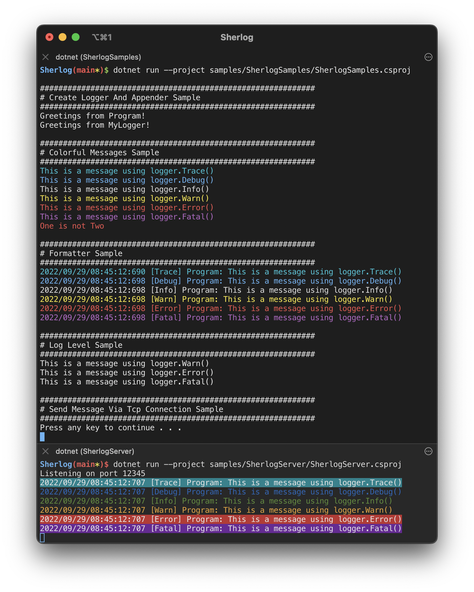

# Sherlog – Flexible logging for C# and Unity

Sherlog is a very light logging library with a clear focus on speed,
flexibility, and extensibility. It supports local and remote logging out of
the box so you can receive log messages from other devices over the air.

[](https://github.com/sschmid/Sherlog/actions/workflows/ci.yml)
[](https://coveralls.io/github/sschmid/Sherlog)
[](https://www.nuget.org/packages/Sherlog)
[](https://github.com/sschmid/Sherlog/blob/main/LICENSE.md)
[][twitter-sschmid]

# Install

|                    | NuGet                                                                                                            |
|:-------------------|:-----------------------------------------------------------------------------------------------------------------|
| Sherlog            | [](https://www.nuget.org/packages/Sherlog)                       |
| Sherlog.Appenders  | [](https://www.nuget.org/packages/Sherlog.Appenders)   |
| Sherlog.Formatters | [](https://www.nuget.org/packages/Sherlog.Formatters) |

# Quick Start

The SherlogSamples project contains samples for different use cases,
such as logging to the console, adding colors or timestamps,
and sending log messages via TCP to other devices.

### See [SherlogSamples](https://github.com/sschmid/Sherlog/blob/main/samples/SherlogSamples/Program.cs)

```
dotnet run --project samples/SherlogSamples/SherlogSamples.csproj
```

Run the SherlogServer project to receive the sample log messages
from SherlogSamples via a TCP connection.

### See [SherlogServer](https://github.com/sschmid/Sherlog/blob/main/samples/SherlogServer/Program.cs)

```
dotnet run --project samples/SherlogServer/SherlogServer.csproj listen 12345
```



# Sherlog terminology

## LogLevel
There are 6 [log levels](https://github.com/sschmid/Sherlog/blob/main/src/Sherlog/src/LogLevel.cs)
matching the Sherlog log methods:

```csharp
logger.Trace("This is a message using logger.Trace()");
logger.Debug("This is a message using logger.Debug()");
logger.Info("This is a message using logger.Info()");
logger.Warn("This is a message using logger.Warn()");
logger.Error("This is a message using logger.Error()");
logger.Fatal("This is a message using logger.Fatal()");
```

You can set the log level per logger or globally for all existing and future loggers.

```csharp
Logger.GlobalLogLevel = LogLevel.Warn;
```

```csharp
var logger = Logger.GetLogger("MyLogger");
logger.LogLevel = LogLevel.Debug;
```

Only log methods that match or exceed the current log level will forward
messages to appenders.

## Appenders
Sherlog's plugin architecture lets you add multiple different appenders
to handle log messages. An appender is a delegate method which contains
the logic for processing log messages. It might write a message to a file,
print it to the console or send it over the network via TCP.
You can easily write your own appenders. There are no limits!

Sherlog comes with a handful of pre-made appenders and helper classes to get you started quickly:

### see [Sherlog.Appenders](https://github.com/sschmid/Sherlog/tree/main/src/Sherlog.Appenders/src)

## Formatters
Similar to appenders you can add formatters to decorate messages with additional
info like logger name, log level, timestamp, or color.

### see [Sherlog.Formatters](https://github.com/sschmid/Sherlog/tree/main/src/Sherlog.Formatters/src)

# Maintainer(s)
[@sschmid on GitHub][github-sschmid] - [@s_schmid on Twitter][twitter-sschmid]

[github-sschmid]: https://github.com/sschmid "@sschmid"
[twitter-sschmid]: https://twitter.com/intent/follow?original_referer=https%3A%2F%2Fgithub.com%2Fsschmid%2FSherlog&screen_name=s_schmid&tw_p=followbutton "s_schmid on Twitter"
